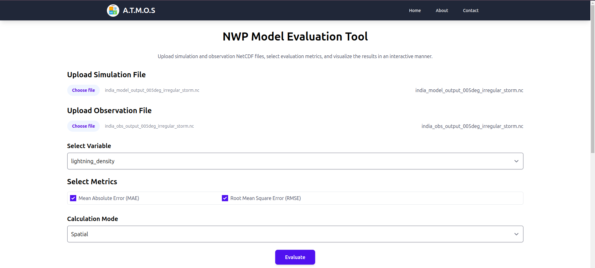
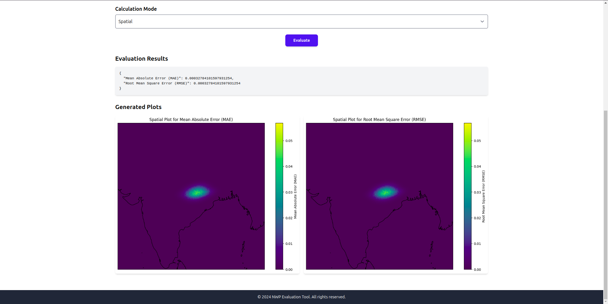
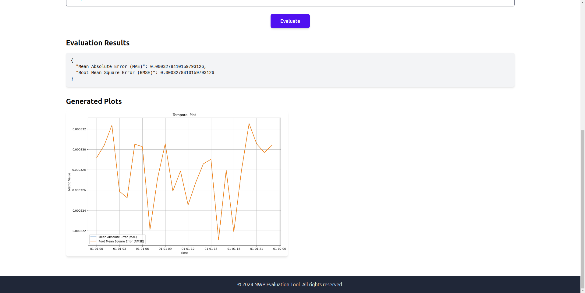
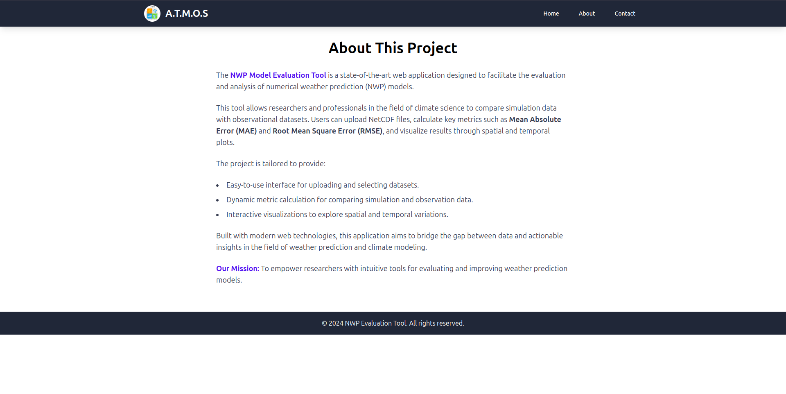
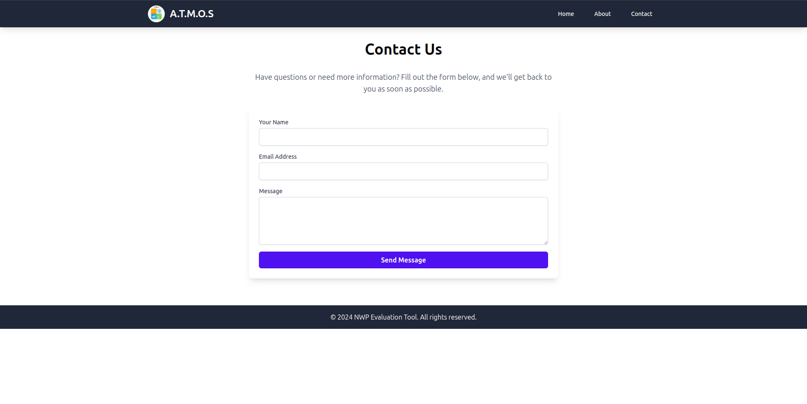

# ATMOS
### **Advanced Toolkit for Modeling and Observing Systems**


---

## **Sections:**
   - Overview
   - Key Features
   - Tech Stack
   - Installation
   - Screenshots
   - Development Roadmap
   - Contributing and License


## **Overview**
**ATMOS** is a comprehensive web application designed for evaluating Numerical Weather Prediction (NWP) models. It empowers users to upload simulation and observation data, calculate essential metrics, and visualize the results using state-of-the-art tools. This toolkit is tailored for researchers, students, and professionals in meteorology, climatology, and related fields.

---

## **Key Features**
- 📊 **Metrics Calculation**:
  - Evaluate models using **Mean Absolute Error (MAE)** and **Root Mean Square Error (RMSE)**.
  - Supports more advanced metrics in future updates.
  
- 🌎 **Spatial Analysis**:
  - Compare simulation and observation data over geographical regions.
  - Generate spatial maps for pixel-to-pixel evaluations.

- ⏳ **Temporal Analysis**:
  - Evaluate metrics along the time dimension for dynamic comparisons.
  - Visualize temporal variations across datasets.

- 🔄 **User-Friendly Interface**:
  - Upload NetCDF files and select specific variables effortlessly.
  - Choose from multiple calculation modes: **Overall**, **Spatial**, and **Temporal**.

---

## **Tech Stack**
| **Technology**     | **Purpose**                     |
|---------------------|---------------------------------|
| React.js            | Frontend                       |
| Flask               | Backend                        |
| Tailwind CSS        | UI Styling                     |
| xarray              | NetCDF Data Manipulation       |
| Matplotlib & Cartopy| Visualization                  |
| Docker              | Containerization               |

---

## **How to Use**

### **1. Installation**
Clone the repository:
```bash
git clone https://github.com/shiv3679/ATMOS.git

cd ATMOS
```

### **2. Backend Setup**
 
Navigate to the `backend/` folder:
```bash
cd backed
```
Install dependencies:

```bash
pip install -r requirements.txt
```
### **3. Frontend Setup**

Navigate to the `atmos-app/` folder:

```bash
cd ../atmos-app
```

Install dependencies:

```bash
npm install
```

Run the frontend:

```bash
npm start
```

Access the app at http://localhost:3000.

## Features in Detail
### 📂 File Upload
 - Upload simulation and observation NetCDF files.
 - Automatically detect and select variables from the uploaded files.
### 📈 Metrics Evaluation
 - Choose metrics for evaluation.
 - Visualize results for overall, spatial, or temporal analyses.
### 🗺️ Interactive Visualization
 - Generate dynamic spatial plots.
 - Compare time-series data with intuitive temporal plots.

 ## Screenshots

 ### Home Page

 

 ### Spatial Plot
 

 ### Temporal Plot


 ### About Page

 

 ### Contact Page

 

## Contributing
Contributions are welcome! Feel free to open issues or submit pull requests to enhance the application.

## Contact
- **Author:** Shiv Shankar Singh
- **Email:** shivshankarsingh.py@g,ail.com

